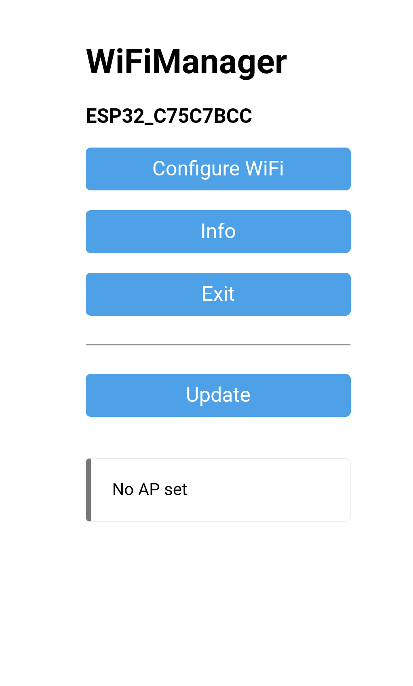
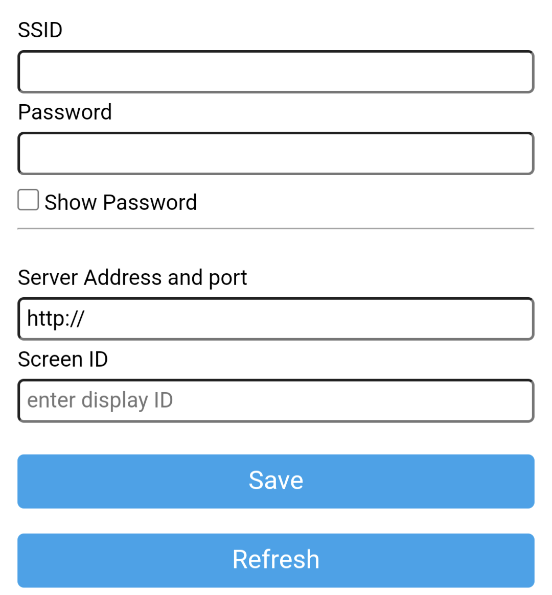
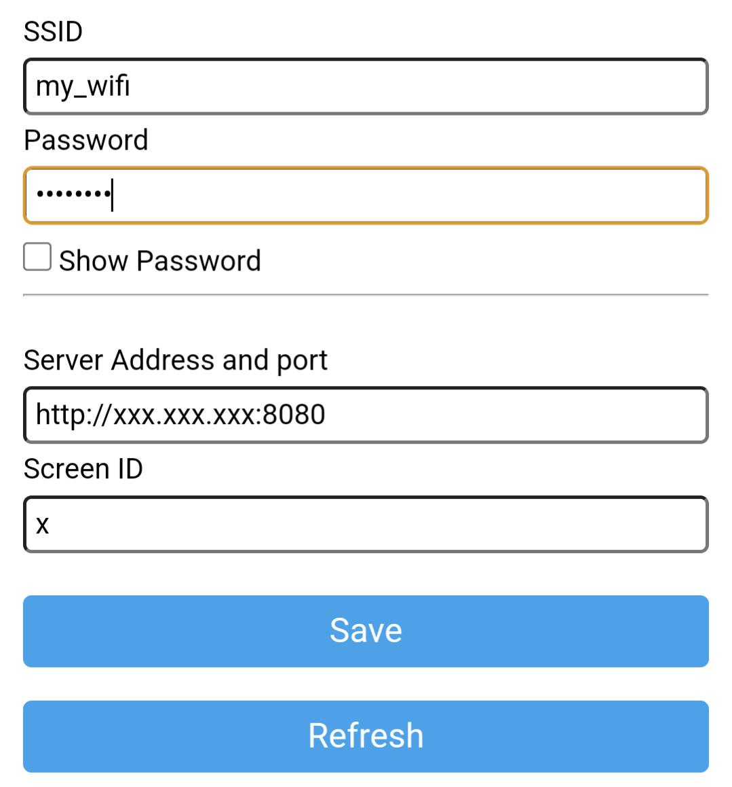
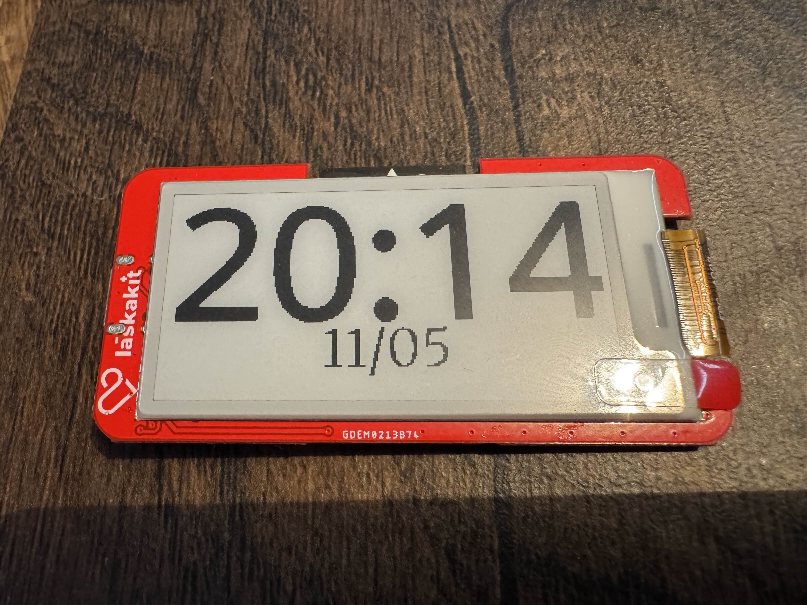
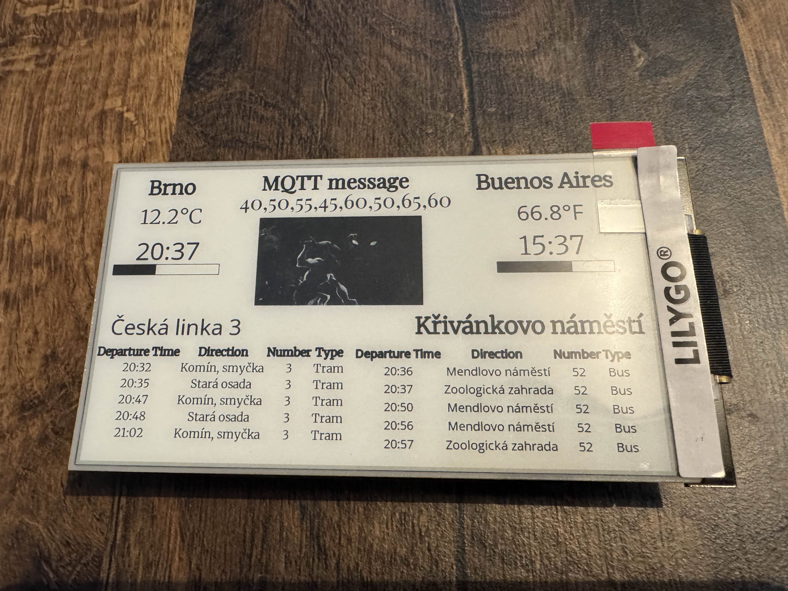
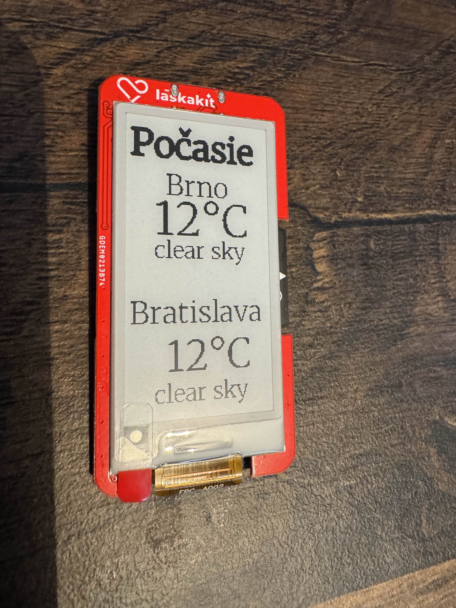

# Full Stack Application for Managing Content on E-Ink Displays

This is a full-stack web application composed of a frontend and backend. The frontend is built with **Vite**, and the backend runs on **Flask**. It is designed to efficiently manage and display content on e-ink displays.

Currently, it includes:
- 4 types of data sources
- 4 types of widgets
- 2 natively supported displays:
  - [LaskaKit ESPink-Shelf-2.13 ESP32e-Paper](https://www.laskakit.cz/en/laskakit-espink-shelf-213-esp32-e-paper/)
  - [LilyGO TTGO T5-4.7" E-Paper ESP32 WiFi Module](https://www.laskakit.cz/en/lilygo-ttgo-t5-4-7--e-paper-esp32-wifi-modul/)

---

## ⚙️ Requirements

- [Docker Desktop](https://www.docker.com/) installed
- Ports `5000` (backend) and `8080` (frontend) must be available

---

# 🚀 Installation and Running the Application

To run the application locally using Docker Compose:

1. Clone the repository:
   ```bash
   git clone https://github.com/JustVirgo/REMOTE-CONTROL-OF-AN-E-INK-DISPLAY.git
   cd REMOTE-CONTROL-OF-AN-E-INK-DISPLAY
   ```

2. Start the application with Docker Compose
    ```bash
    docker-compose up --build
    ```

3. After successful startup, the following services will be available:
    - Frontend: http://localhost:8080
    - Backend (API): http://localhost:5000

4. To allow the display to communicate with the server, ensure port 8080 is forwarded/opened on your server.

## Notes
- This approach was tested on macOS, Linux and Windows machines. 
- In case you are on macOS you might need to change the backend port, in the *docker-compose.yaml* on line **7** change **5000:5000** to **5001:5001** or so
- On the first run, building Docker images may take several minutes depending on your internet connection and system performance.
- If you make changes to the source code, it's recommended to use docker-compose up --build to apply the changes.

# 🧑‍💻 Basic User Guide
Here I will explain the basics on how to orient in the user interface and how to setup a supported display.
## 📡 Creating a Data Source
1. Go to the **Manage sources** tab.
2. Select a data source type (e.g., DPMB Departures, MQTT, Time, Weather).
3. Fill in the required fields
4. Click the green checkmark to create the source.
5. 🎉 You now have a working data source!

## 🖥️ Creating a Screen
Screen are basically virtual displays where you can place your widgets. Widgets can contain a reference to a data source you've created or a picture, text or progress bar. Folow these steps to create a new screen:
1. Go to the **Manage screens** tab.
2. Click the + button to start creating a new screen.
3. Select a supported display or fill out the fields manually.
4. Give your screen a name.
5. Set the Refresh time (s). Note: Lower values increase power consumption.
6. Click the ✅ button to save.

Your new screen will appear in the list. You can edit it ⬛, manage its contents 🟨, or delete it 🟥.

### Screen Editor Overview
 - Left panel: Add widgets and manage existing ones.
 - Right panel: Visual preview of your screen layout.

 After clicking on one of the widgets in the left bar you will be prompted with inputs depending on which input you've chosen. 

Each widget type has its own input fields:
 - Text: Enter text, font size, font family, style (bold/italic).
 - Value from source: Select a data source, font settings.
 - Image: Upload .jpg or .png, specify size (in pixels).
 - Progress bar: Set data source, range, color, and size (in pixels).

 After clicking the Add widget button the widget will appear both in the screen area and the list of widgets in the display. You can move widgets freely. If widgets overlap and can’t move, use the rightmost toggle above the screen to disable collisions.

 Other buttons at the top of the screen:
 - Toggle layout (landscape/portrait)
 - Flip image along X or Y axis (affects only the display output, not the UI)

## 💾 Downloading/Uploading Code
Go to the Download/Upload Code tab.
You have two options:
 - Manual: Download Arduino code and flash it yourself.
 - Automatic: Select a supported display and flash it directly from the UI. 
 >Note: first time compiling for a display will take a really long time (up to 20 minutes)

 ⚠️ Web Serial API is supported only in some browsers: [Browser Compatibility](https://developer.mozilla.org/en-US/docs/Web/API/Web_Serial_API#browser_compatibility).

 # 📟 Setting Up the Display
Once the code is uploaded to your display, restart it.

Wi-Fi Configuration

>The configuration is handled using the [Wifimanager](https://github.com/tzapu/WiFiManager) library.
1. Use a smart device (phone/tablet/laptop).
2. Go to Wi-Fi settings and connect to a network named ESP_xxxxxxxx.
3. A setup page will appear:



4. Click on `Configure WiFi` and fill in the following:



 - Wi-Fi name
 - Wi-Fi password
 - Server IP address and port (e.g., 192.168.1.35:8080)
 - Screen ID from the UI
    - Find it in the **Manage screens** tab next to your screen name.
    Example filled form:

    

5. Click **Save**. If setup is correct, the display will show the selected layout.

❌ If nothing happens:
 - Wait a moment and check if the ESP_xxxxxxxx network reappears.
 - If yes, reconnect and reconfigure.
 - If the display is connected to your wifi but shows nothing, check that:
    - The server is running
    - Port forwarding is enabled

# Below you can see some example project outputs:
  ## Basic clock:
  
  

  ## Example for all the widgets:

  

  ## Weather dashboard:


# 🛠️ Advanced User Guide
Want to extend the app? You can:
 - Add a new data source type
 - Add a new display type

## 🧾 Adding a New Type of Data Source

To integrate a new data source into the application, follow the steps below.

---

### 1. Define Inputs

Open the file `backend/data/datasets.json`.  
Define new type of data source in the following format:
```json
{
    "New_type_name":{
        "inputs": {
            { "input_name": ["input_type", "optional", "default_value", "argument_based_on_type"] }
        }
    }
}
```

#### Supported Input Types and arguments:

- **String** – a simple text input. (no argument)
- **List String** – a list of text items. (no argument)
- **Int** – integer number. (no argument)
- **Float** – decimal number. (no argument)
- **Switch** – a toggle switch; expects an argument in the format `{ "from": <value>, "to": <value> }`.
- **Picker** – a dropdown selection; expects an argument in the format `{ "options": [<option1>, <option2>, ...] }`.
- **Whisper** – an autocomplete input; expects an argument in the form of a server-side file path. It suggests values based on already typed characters (minimum two).

---

### 2. Create the Python Class

1. Create a new folder in `backend/datasets/`
2. Add a new file inside it (e.g., `your_source.py`)
3. Inherit from `DataSource` class (from `datasource_base.py`)
4. Implement methods:

    - `__init__(self, inputs, uid)`  
  Called when a new instance is created. It receives input definitions from the JSON file and stores them along with a unique ID. Common instance variables include `inputs`, `uid`, `last_updated`, and `cached_data`.

    - `fetch_data(self)`  
  Implement logic to retrieve and store new data in `cached_data`.

    - `get_data(self)`  
  Returns the cached data in a serializable format.

    - `get_update_interval(self)`  
  Defines how often the data should be updated (in seconds). This can return a constant value or be derived from the input parameters.

    - `get_name(self)`  
  Returns the name of the data source as it should appear in the UI.

    - `get_uid(self)`  
  Returns the unique identifier (`uid`) of the instance.

    - `update_data(self, force=False)`  
  Already implemented in the base class. Periodically called by the `controller.py` to manage data updates.

---

### 3. Register the Class

Open `backend/data/controller.py`.

At the top of the file import your class

Add to `SOURCE_CLASSES` (Around line 21):
 ```python
 "YourType": YourClass
 ```

#### Make sure:
- "YourType" exactly matches the name defined in datasets.json.

- YourClassName matches the name of the class you defined.

- Your class is imported at the top of the `controller.py` file.


## 📺 Adding a New Display Type

### 1. Create Display Firmware (.ino)

Navigate to: `backend/displays/codes/Supported_Displays/`

1. Copy the `New_display.ino` file
2. Inside the copy fill in the definitions for the two functions: `InitDisplay()` and `printToDisplay(uint8_t *buffer, uint32_t len)`.
3. At the top of the file, add a `#define` corresponding to the display name.

#### Format for the name:
- Use **only letters and numbers**.
- Replace **spaces with underscores**.
- Surround the name with double underscores:  
  Example display name: `LilyGO TTGO T5-4.7`  
  → `#define __LilyGO_TTGO_T5_4_7__`

### 2. Implement Image Conversion Function
Navigate to: `backend/display.py` 

Add a function to convert PNG → binary data
(e.g., `convert_image_to_4bpp_bin(...)`)

### 3. Register Conversion in main.py
Navigate to:
`backend/main.py` 

In the `get_screen_picture` function, register your display type using a match case statement (around line 177):
``` python
match display["type"]:
    case "1bpp":
        dsp.convert_image_to_1bpp_bin(...)
    case "4bpp":
        dsp.convert_image_to_4bpp_bin(...)
    case "your_type":
        dsp.convert_image_to_your_type_bin(...)
    case _:
        RuntimeError("Display type does not exist")
        abort(500, description="Failed to generate screen picture")
```
Make sure `"your_type"` exactly matches the `"type"` field from `displays.json`.


### 4. Update Display Metadata

Navigate to: `backend/data/displays.json` and add a new entry for the display. The entry should contain the following properties:

- `id`: Unique identifier for the display (must not conflict with existing IDs).
- `name`: Display name that will be shown in the UI.
- `type`: The type of image conversion function to be used in the backend.
- `chip`: The chip model used in the display hardware.
- `resolutionX` and `resolutionY`: The native width and height of the display.
- `fqbn`: Fully Qualified Board Name used by Arduino CLI for compiling.
- `esp32-lib-version`: Version of the ESP32 Arduino library to use.
- `compilation_flags` (optional): Additional configuration options for Arduino CLI during the compilation process. You can get theirs format using command `arduino-cli board details --fqbn <board_fqbn>` (if you have arduino cli installed)

example:
```JSON
{
    "id": 2,
    "name": "LilyGO_TTGO_T5-4.7",
    "type": "4bpp",
    "chip": "esp32",
    "resolutionX": 960,
    "resolutionY": 540,
    "fqbn": "esp32:esp32:esp32s3",
    "esp32-lib-version": "2.0.15",
    "compilation_flags": {
        "CDCOnBoot":      "cdc",
        "USBMode":      "hwcdc",
        "FlashSize":         "16M",
        "PartitionScheme":   "app3M_fat9M_16MB",
        "PSRAM":             "opi"
        }
}
```
